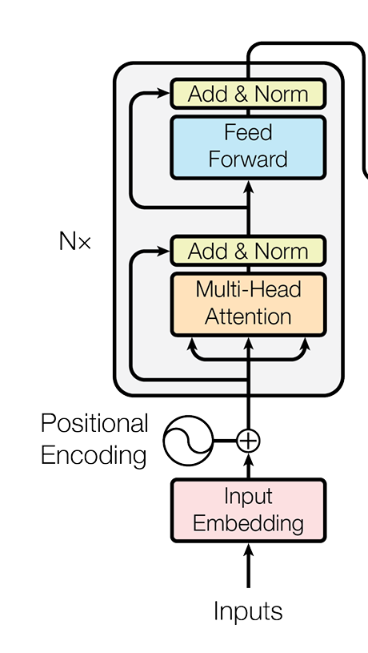

# BERT: Pre-training of Deep Bidirectional Transformers for  Language Understanding

BERT stands for Bidirectional Encoder Representations from Transformers. 
Designed to pre-train deep bidirectional representations from unlabeled 
text by jointly conditioning on both left and right context in all layers. 
BERT alleviates the previously mentioned unidirectionality constraint by using a “masked language model” (MLM) 

There are two steps in this framework: **pre-training** and **fine-tuning.**
During pre-training, the model is trained on unlabeled data over different pre-training tasks. 
For fine-tuning, the BERT model is first initialized with the pre-trained parameters, 
and all of the parameters are fine-tuned using labeled data from the downstream tasks. 
Each downstream task has separate fine-tuned models,  even though they are ini tialized with the same pre-trained parameters

### 1. Model Architecture 

BERT’s model architecture is a multi-layer bidirectional Transformer encoder based on the original 
implementation described in Vaswani et al. (2017) and released in the tensor2tensor library 

BERT is only an encoder, while the original transformer is composed of an encoder and decoder.
Given that BERT uses an encoder that is very similar to the original encoder of the transformer, 
we can say that BERT is a transformer-based model. So, BERT does not use recurrent connections,
but only attention and feed-forward layers. There are other transformer-based neural networks 
that use only the decoder part of the transformer, for example, the GPT model.

### 2. BERT fundamental strategies

BERT uses two unsupervised tasks:

- **1: Masked LM Intuitivel,** it is reason able to believe that a deep bidirectional model is
 strictly more powerful than either a left-to-right model or the shallow concatenation of a left-to right
 and a right-to-left model. 
In order to train a deep bidirectional representation, we simply mask some percentage of the input
tokens at random, and then predict those masked tokens. In this case, the final hidden vectors corresponding to the
 mask tokens are fed into an output softmax over the vocabulary, as in a standard LM. 
 
 - **2: Next Sentence Prediction (NSP),**  Many important downstream tasks such as Question Answering (QA) 
 and Natural Language Infer ence (NLI) are based on understanding the relationship between two sentences, 
 which is not directly captured by language modeling. In order to train a model that understands sentence 
 relationships, we pre-train for a binarized next sentence prediction task that can be trivially generated from any monolingual corpus
 
 
 ### 3. Result: 
 
 For the training I used [https://drive.google.com/file/d/1hb34ZJb1wNzP4Lsw6V_AmuSt8PrA0dKe/view?usp=drive_link](https://drive.google.com/file/d/1hb34ZJb1wNzP4Lsw6V_AmuSt8PrA0dKe/view?usp=drive_link)
 I extracted only comment_review and toxic columns. I fined-tune the model 
 
 - EPOCHS : 8
 - BACTH_SIZE : 32
 - LEARNING RATE : 2e-5 (Adam)
  
 I oberverved the accuracy of 97% 
 
 
 
 
 
 
 
 
 
 
 
 
 
 
 
 
 
 
 
 
 
